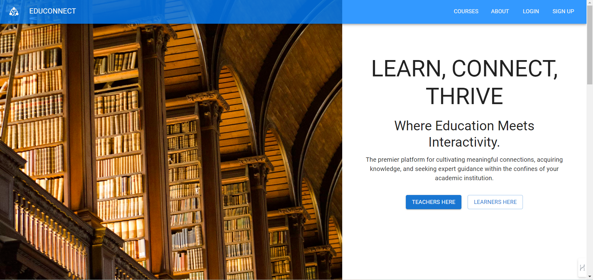
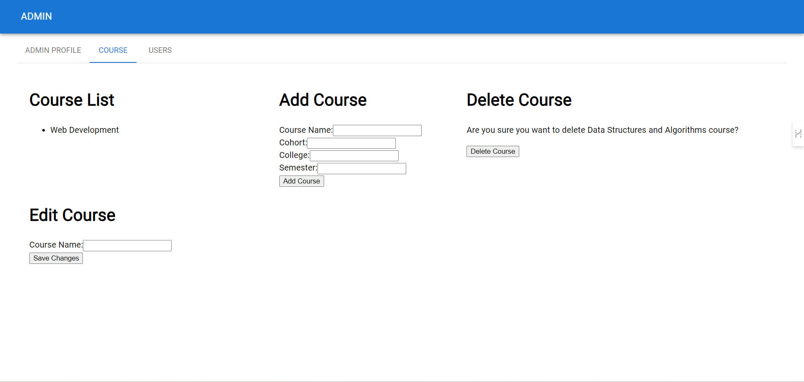
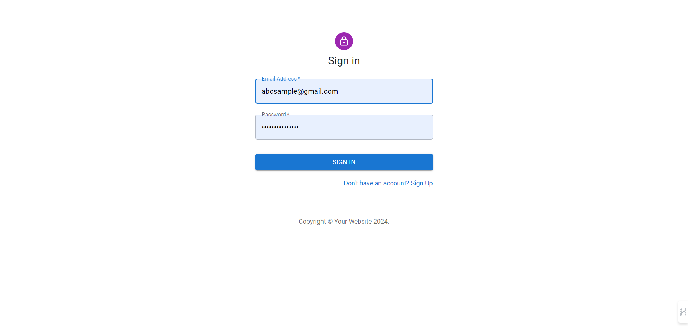
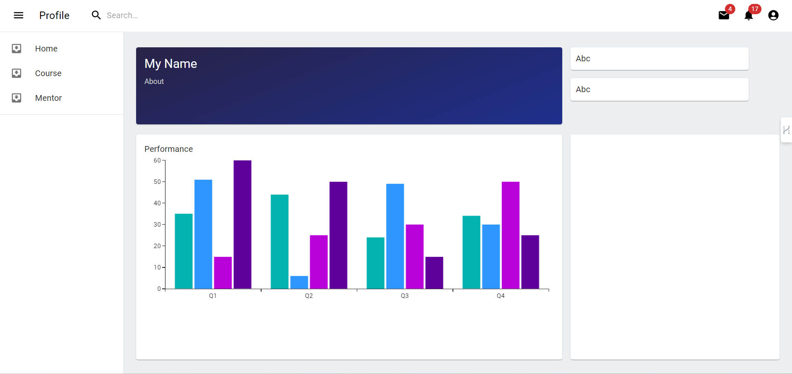

## EduConnect

### API's documentation: https://documenter.getpostman.com/view/29753054/2s9YymGjLf

### Backend deployed link in Render: https://edu-connect-xds8.onrender.com

### Frontend deployed link in Netlify: https://educonnectlive.netlify.app/

### Design: https://www.figma.com/file/av8dMDoXAdtqC6tyNxGwdH/Edu-Connect?type=design&node-id=0%3A1&mode=design&t=2HlXrbXXVTdlu6tj-1

### ScreenShots:

- Problem Statment:
 
  - Students lack accessible and convenient ways to connect with experienced seniors and alumni from their own college, hindering their ability to get academic help, career guidance, and mentorship.

  - We need a platform or service that facilitates meaningful connections between current students and college alumni, bridging the gap and empowering students to seek academic guidance, mentorship, and career support from experienced individuals.

- Project Description: 

  - Facilitates novice students in establishing connections, learning, and seeking clarification from seniors within their college. Many students struggle to grasp the subjects taught in class and often find it challenging to address their doubts promptly, leading to a waning interest in the subject. This web application serves as a platform to connect these students with their seniors, enabling them to learn, share knowledge, clarify doubts, and excel in their studies.

- What are existing similar solutions?

  - Khan Academy: https://www.khanacademy.org/
  - Chegg Tutors: https://www.chegg.com/
  - Tutor.com: https://www.tutor.com/
  - Wyzant: https://www.wyzant.com/
  - StudyGate: https://www.studygate.com/
  - Varsity Tutors: https://www.varsitytutors.com/
  - TutorMe: https://tutorme.com/

- Features:

  - User Profiles: Detailed profiles for both knowledgeable and unfamiliar students with information about their expertise, interests, and learning goals.

  - Skill Matching: Algorithms to match knowledgeable students with unfamiliar students based on their skills, subjects, and learning preferences. 

  - Interactive Communication: Chat and messaging features to facilitate real-time communication between mentors and learners.
   Video conferencing for virtual face-to-face interactions. 

  - Discussion Forums: Dedicated discussion boards for each subject or skill, allowing students to ask questions and share insights.
   Moderation tools to ensure a positive and respectful learning environment.

  - Collaborative Tools: Shared document editing, whiteboards, and collaborative project spaces for hands-on learning and collaboration.
   Code-sharing environments for programming and technical subjects.

  - Appointment Scheduling: Calendar integration for scheduling mentoring sessions and study group meetings.
   Reminders and notifications for upcoming sessions.

  - Resource Sharing: File-sharing capabilities for sharing study materials, lecture notes, and additional resources.
   Integration with cloud storage services for seamless sharing.

  - Test and Assessment: Quiz and assessment features to evaluate learners' understanding.
   Instant feedback on assessments, highlighting areas for improvement.

  - Progress Tracking: Dashboards displaying progress for both mentors and learners.
   Analytics to track engagement, learning milestones, and achievements. 

  - In-app Notifications: Notifications for new mentoring requests, upcoming sessions, and forum activity.
   Customizable notification preferences for users.

  - Feedback and Ratings: Mechanisms for learners to provide feedback on mentoring sessions.
   Rating system for mentors to build credibility and trust.

  - Privacy Controls: Privacy settings for users to control the visibility of their profiles and learning activities.
   Compliance with data protection regulations.

  

  

